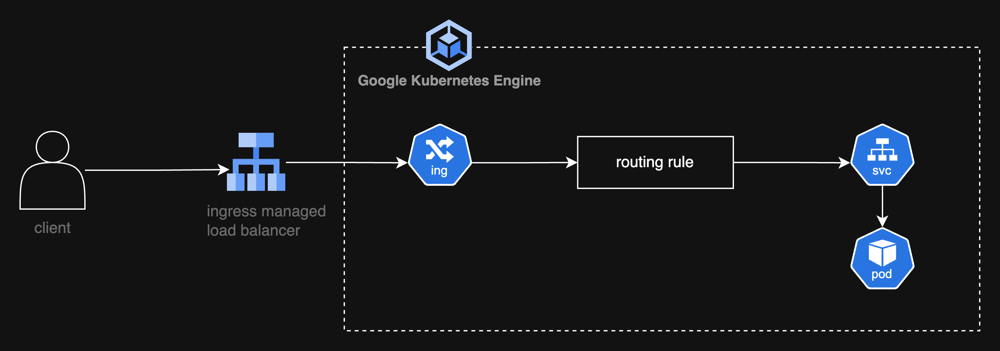

# Ingress Overview


# Kubernetes Ingress Overview

Accessing applications from outside a Kubernetes cluster is essential for serving users at scale. Kubernetes uses an abstraction called **Ingress** to route external HTTP/HTTPS traffic to services within the cluster. By defining hostname- and path-based rules, Ingress acts as a reverse proxy or load balancer, enabling:

- Multiple services under a single IP
- SSL/TLS termination at the edge
- Name-based virtual hosting

> Note: Creating an Ingress resource has **no effect** until you deploy an **Ingress Controller**, which watches those resources and configures the edge component (e.g., NGINX or a cloud load balancer) to implement your routing rules.

Ingress Controllers run as Pods in your cluster, providing scalability and self-healing. Many offer SSL/TLS termination, authentication, and DNS integration.

## Popular Ingress Controllers

| Controller                 | Features                                      |
|---------------------------|-----------------------------------------------|
| NGINX Ingress Controller  | Widely adopted, rich annotation support       |
| Traefik                   | Dynamic configuration, Let's Encrypt support  |
| HAProxy Ingress           | High performance, advanced routing rules      |

Cloud platforms like AWS, GKE, and AKS also provide **managed controllers** that integrate with their load balancers and DNS services.

---

## Ingress vs. Service

| Aspect            | Service (NodePort/LoadBalancer) | Ingress                         |
|-------------------|----------------------------------|----------------------------------|
| Protocols         | TCP/UDP, HTTP                    | HTTP/HTTPS only                 |
| Port Exposure     | Arbitrary ports                  | Ports 80 and 443               |
| Routing           | None                             | Host- and path-based            |
| TLS Termination   | Not supported                    | Built-in at the edge            |
| Virtual Hosting   | No                               | Name-based                      |

---

## Key Ingress Concepts

1. **Ingress Rules**: Map hostnames and URL paths to specific services and ports.
2. **Default Backend**: Handles requests that don't match any rule.
3. **Resource Backend**: References another Kubernetes resource instead of a service.
4. **Path Types**:

   | Path Type            | Behavior                          |
   |----------------------|-----------------------------------|
   | Exact                | Matches the full path exactly     |
   | Prefix               | Matches based on the URL prefix   |
   | ImplementationSpecific | Controller-defined logic         |

5. **Annotations**: Enable controller-specific features like SSL redirection, URL rewrites, or rate limiting.
6. **TLS Configuration**: Uses Kubernetes Secrets to store certs/keys for HTTPS.

### Example Ingress YAML
```yaml
apiVersion: networking.k8s.io/v1
kind: Ingress
metadata:
  name: example-ingress
  namespace: default
spec:
  defaultBackend:
    service:
      name: default-service
      port:
        number: 80
  rules:
  - host: "example.com"
    http:
      paths:
      - path: /web
        pathType: Prefix
        backend:
          service:
            name: web-service
            port:
              number: 80
```
> All traffic not matching `/web` is sent to `default-service:80`.

---

## Common Ingress Patterns

- **Single-Service Ingress**: Routes all traffic to one backend.
- **Simple Fan-Out**: Path-based routing to multiple services.
- **Name-Based Virtual Hosting**: Hostname-based routing for multiple domains.
- **TLS/SSL Termination**: Decrypts HTTPS at the edge and forwards HTTP to services.

Benefits:
- Centralized traffic management through a single entry point
- Simplified certificate handling with edge SSL/TLS termination
- Flexible path- and host-based routing
- Auto-scaling and high availability
- Native integration with cloud load balancers and DNS

---

## Ingress Resource vs Ingress Controller

| Aspect              | Ingress Resource                             | Ingress Controller                              |
|---------------------|-----------------------------------------------|--------------------------------------------------|
| Definition          | Kubernetes object for routing rules           | Component (Pod) that reads Ingress objects       |
| Functionality       | Declares host/path rules                      | Implements rules, load-balances traffic          |
| Runtime             | No running process                            | Runs inside cluster                              |
| Benefit             | No effect without a controller                | Routes external traffic to Services              |

---

## Kubernetes Architecture with Ingress

Clients send HTTP(S) requests to the cluster’s external endpoint. The Ingress controller intercepts these requests, matches them against Ingress rules, and forwards them to the appropriate Service, which then load-balances to the backend Pods.




---

## Cloud-based Ingress Controllers

| Controller                 | Cloud Provider | Key Features                                      |
|---------------------------|----------------|---------------------------------------------------|
| AWS Load Balancer Controller | AWS           | ALB & NLB provisioning, Auto scaling              |
| Google Cloud Load Balancer   | GCP           | GKE integration, Global load balancing            |
| Azure Application Gateway    | Azure         | SSL termination, WAF, path-based routing          |

**Key Benefits**:
- Automatic provisioning of cloud LoadBalancer resources
- Built-in security features (WAF, IAM integration)
- Managed upgrades and high availability
- Reduced operational overhead

---

## Non-cloud-based Ingress Controllers

| Controller              | Use Case          | Highlights                                       |
|-------------------------|-------------------|--------------------------------------------------|
| NGINX Ingress Controller | General purpose   | Reverse proxy, SSL/TLS, rate-limiting            |
| Traefik                 | Dynamic auto-config | HTTP/HTTPS routing, metrics, dashboard         |
| HAProxy Ingress         | Performance-focused | Low-latency load balancing, TCP support         |

> Requires exposing the controller using a `LoadBalancer` or `NodePort` service.

---

## Deployment Models: Deployment vs DaemonSet

| Option      | Pros                                                      | Cons                                         |
|-------------|-----------------------------------------------------------|----------------------------------------------|
| Deployment  | Dynamic scaling, resource-efficient                      | Uneven load distribution on nodes            |
| DaemonSet   | One Pod per node, uniform traffic distribution, high availability | Higher resource usage per node count |

**Use `Deployment`** when traffic patterns fluctuate and you want to optimize resource usage.  
**Use `DaemonSet`** for uniform low-latency ingress on every node and built-in failover.

---

## Factors to Consider

Before selecting an Ingress controller or deployment model, evaluate:

- Traffic volume, throughput, and latency requirements
- Scaling capabilities (static vs dynamic)
- Features: supported protocols, SSL/TLS, middleware (auth, rate limiting)
- Integration with your cloud or on-prem infrastructure
- Configuration complexity and learning curve
- API/automation support for CI/CD integration
- Community support, plugin ecosystem, and commercial options
- Cost: managed service fees vs self-managed resource costs
- High availability, failover strategies, and load balancing algorithms

---

## Reference

- [Kubernetes Ingress Documentation](https://kubernetes.io/docs/concepts/services-networking/ingress/)
