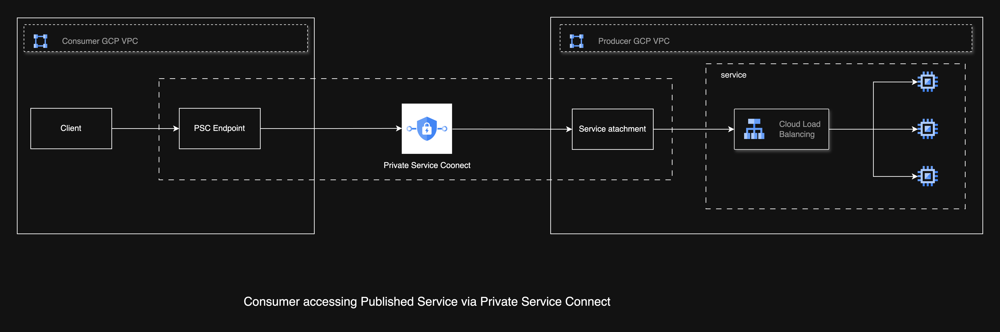

# Private Service Connect with Zero Trust Architecture

Design, workflow, and security model for implementing **Google Cloud Private Service Connect (PSC)** under a **Zero Trust (ZT)** architecture.

## Overview

**Private Service Connect (PSC)** allows producer services in one project/VPC to be privately accessed by consumers in another project/VPC, without exposing services to the public internet. Combined with **VPC Service Controls**, **IAM**, and **organization policies**, this architecture enforces strong Zero Trust principles.

## Architecture

This design includes:

- **Producer Project** exposing backend services behind an Internal Load Balancer (ILB) via a PSC Service Attachment.
- **Consumer Project** creating a PSC Endpoint in its VPC subnet to access the producer’s private service.
- All traffic flows through Google Cloud’s **private SDN backbone**, never the public internet.

### Key Components

- **Internal Load Balancer**: Fronts producer services, providing L4/L7 protection.
- **PSC Service Attachment**: Publishes producer service privately.
- **PSC Endpoint**: Consumer’s access point to producer’s service.
- **VPC Service Controls**: Prevents unauthorized data access and exfiltration.
- **Google Cloud SDN**: Routes traffic privately over GCP’s backbone.

## High-Level Workflow

1. **Consumer**
   - Creates a PSC Endpoint in a chosen VPC subnet. It enables private, secure communication to services without using the public internet.
   - Applications call the private IP of the PSC Endpoint.
   - Any requests sent to the PSC endpoint private IP are caught by the forwarding rule.
   - The forwarding rule uses Google’s VPC network infrastructure to route traffic to the linked PSC service attachment.

2. **Producer**
   - The producer service is exposed internally via a PSC service attachment.
   - Requests traverse the GCP SDN fabric to the Service Attachment.
   - This service attachment is linked to a regional Internal Load Balancer on the producer VPC.
   - The ILB forwards the request to the actual backend service.

## Software-Defined Networking in PSC

PSC relies on GCP’s global SDN fabric to:

- **Inject routes automatically**
  - PSC Endpoint creates a `/32` route in the consumer VPC subnet.
- **Create private overlays**
  - A private tunnel between PSC Endpoint and Service Attachment.
- **Enforce IAM and VPC-SC policies**
  - Deny traffic at the fabric level if policies are not satisfied.
- **Support multi-path forwarding**
  - Ensures low latency and high availability.
  

## NAT Behavior in PSC

### Multiple NAT Subnets per Service Attachment

- A PSC Service Attachment can use **multiple NAT subnets** for scaling.
- Each NAT subnet provides a pool of IPs to handle SNAT for many consumer connections.
- This prevents SNAT port exhaustion when there are thousands of concurrent consumers.

### One NAT Subnet per Service Attachment

- A **NAT subnet cannot be shared across multiple Service Attachments**.
- Reason:
  - To avoid overlapping IP allocation.
  - To simplify connection tracking in the SDN fabric.

## Consumer Endpoint Placement

The PSC Endpoint must be created in a **specific subnet** of the consumer VPC:

- Ensures private routing within the consumer VPC.
- Applications in the subnet route traffic to the PSC Endpoint’s VIP.
- Only workloads within the VPC (or subnet) can use the endpoint.

## Security Layers

- **IAM on Service Attachment**: Controls which consumers can create endpoints.
- **VPC Service Controls**: Enforces project and perimeter-level access.
- **Org Policies**: Prevents public IPs, enforces Secure Boot/OS Login.
- **ILB Health Checks**: Ensures only healthy backend services are exposed.
- **Cloud Armor (Optional)**: Protects backend from L7 attacks.
- **VPC Flow Logs**: Provides visibility into traffic patterns.

## Scenario: Service-to-Service Communication

### Context

- **Service A**: Frontend API in Project A (VPC-A)
- **Service B**: Payments API in Project B (VPC-B)
- **Objective**: Service A securely consumes Service B over PSC without any public exposure.

### Steps

1. Project B deploys Payments API behind ILB and publishes via PSC Service Attachment.
2. Project A creates a PSC Endpoint in its frontend VPC subnet pointing to the Service Attachment.
3. Service A applications call the PSC Endpoint’s private IP/DNS.
4. Traffic flows privately over GCP’s backbone.
5. VPC-SC perimeter includes both projects to block exfiltration.

### Security Outcome

- Both services are isolated within their own VPCs/projects.
- No internet exposure at any point.
- IAM and VPC-SC enforce identity-based, perimeter-bound access.

## Benefits of This Model

- **No public IP exposure**: Eliminates external attack surface.
- **Identity-based access control**: Fine-grained permissions via IAM and Workload Identity.
- **Data exfiltration protection**: VPC Service Controls block unauthorized movement.
- **Private routing on GCP backbone**: All traffic remains within Google’s network.
- **Scalability with NAT subnets**: Handles high concurrency for thousands of clients.
