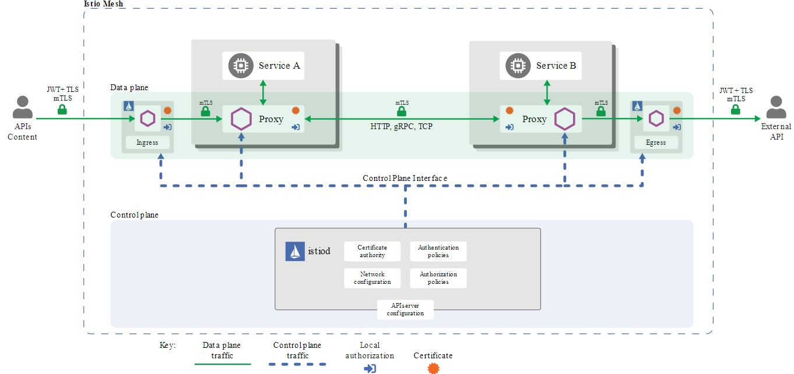

# ISTIO SERVICE-MESH DEPLOYMENT
Istio is an open source service mesh solution that enables developers to connect, control, monitor, and secure microservices architectures

## Table of Contents
- [Istio Service-mesh Architecture](#istio-service-mesh-architecture)
- [Security Architecture](#security-architecture)
- [Key Features of Istio](#key-features-of-istio)
- [Mutual TLS authentication](#mutual-tls-authentication)
- [BookInfo Deployment with Istio Service-mesh](#bookinfo-deployment-with-istio-service-mesh)
- [References](#references)

## Istio Service-mesh Architecture
An Istio service mesh is logically split into a data plane and a control plane

- The data plane is composed of a set of intelligent proxies (Envoy) deployed as sidecars. These proxies mediate and control all network communication between microservices. They also collect and report telemetry on all mesh traffic.
- The control plane manages and configures the proxies to route traffic

### Control Plane
The Istio control plane is built of three key components:

- Pilot—uses the Envoy API to communicate with the Envoy sidecar. The pilot is responsible for traffic management, routing, and service inspection.
- Citadel—provides secure communication between services by managing user authentication, certificate and credential management.
- Galley—responsible for configuration management, distribution, and processing.

### Data Plane
The data plane consists of Envoy proxies deployed as sidecars, running alongside application instances in Kubernetes pods. The Envoy proxies manage traffic for services on the system, including managing and controlling network communication between microservices.

Here are key Istio features and tasks Envoy proxies enable:

- Traffic control: lets you enforce fine-grained traffic control and rich routing rules for gRPC, HTTP, WebSocket, and TCP traffic.
- Network resiliency: features include setup retries, circuit breakers, fault injection, and failovers.
- Security and authentication: Envoy proxies enable Istio to enforce security policies, access control, and rate limiting. You can define it using the configuration API.
- Pluggable extensions: this model is based on WebAssembly, which enables custom policy enforcement as well as telemetry generation for your mesh traffic

## Security Architecture
Microservices have certain security requirements, when a service communicates to another service it's possible for the attacker to intercept the traffic and modify it before it reaches the destination, this is known as the **Man in the Middle Attack** 
To prevent this from happening the traffic between services needs to be encrypted.
Secondly certain services need to implement Accesss Control Restriction, Istio allows this using mutualTLS and fine grained access policies. 
We also like to know who did what, at what time, for this Istio supports audit logs

## Key Features of Istio
- Traffic Management: Istio simplifies the configuration of service-level properties like timeouts, retries, and circuit breakers, and also supports advanced deployment strategies such as canary releases, blue-green deployments, and mirroring.
- Security: Istio provides defense-in-depth and zero-trust network security. It handles authentication, authorization, and encryption of service-to-service and end-user traffic.
- Observability: Istio generates detailed telemetry data for all service communications, including metrics, logs, and traces, which help in monitoring and debugging microservices.
- Policy Enforcement: It allows enforcing policies consistently across the services in your mesh, like rate limits, quotas, and access control

## Mutual TLS authentication
Istio tunnels service-to-service communication through the client- and server-side PEPs, which are implemented as Envoy proxies. When a workload sends a request to another workload using mutual TLS authentication, the request is handled as follows:

- Istio re-routes the outbound traffic from a client to the client’s local sidecar Envoy.
- The client side Envoy starts a mutual TLS handshake with the server side Envoy. During the handshake, the client side Envoy also does a secure naming check to verify that the service account presented in the server certificate is authorized to run the target service.
- The client side Envoy and the server side Envoy establish a mutual TLS connection, and Istio forwards the traffic from the client side Envoy to the server side Envoy.
- The server side Envoy authorizes the request. If authorized, it forwards the traffic to the backend service through local TCP connections.
- Istio configures TLSv1_2 as the minimum TLS version for both client and server with the cipher suites

## BookInfo Deployment with Istio Service-mesh
Deploys a sample application composed of four separate microservices used to demonstrate various Istio features  

The Bookinfo application is broken into four separate microservices:
1. productpage. The productpage microservice calls the details and reviews microservices to populate the page.
2. details. The details microservice contains book information.
3. reviews. The reviews microservice contains book reviews. It also calls the ratings microservice.
4. ratings. The ratings microservice contains book ranking information that accompanies a book review.

There are 3 versions of the reviews microservice:
1. Version v1 doesn’t call the ratings service.
2. Version v2 calls the ratings service, and displays each rating as 1 to 5 black stars.
3. Version v3 calls the ratings service, and displays each rating as 1 to 5 red stars

## References
- [Official Istio Documentation](https://istio.io/latest/docs/)
- [Istio architecture](https://www.solo.io/topics/istio/istio-architecture/)
- [Security Architecture](https://istio.io/latest/docs/concepts/security/)
- [Istio Tutorials and Samples](https://www.solo.io/topics/istio/istio-tutorial/)
- [BookInfo Deployment](https://istio.io/latest/docs/examples/bookinfo/)