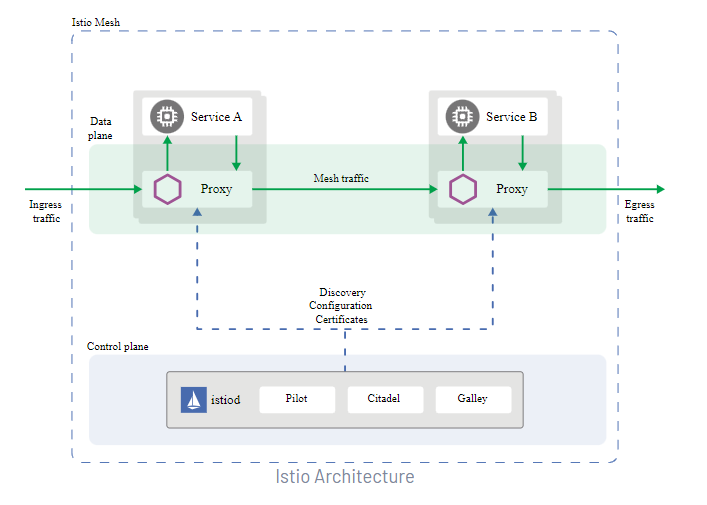
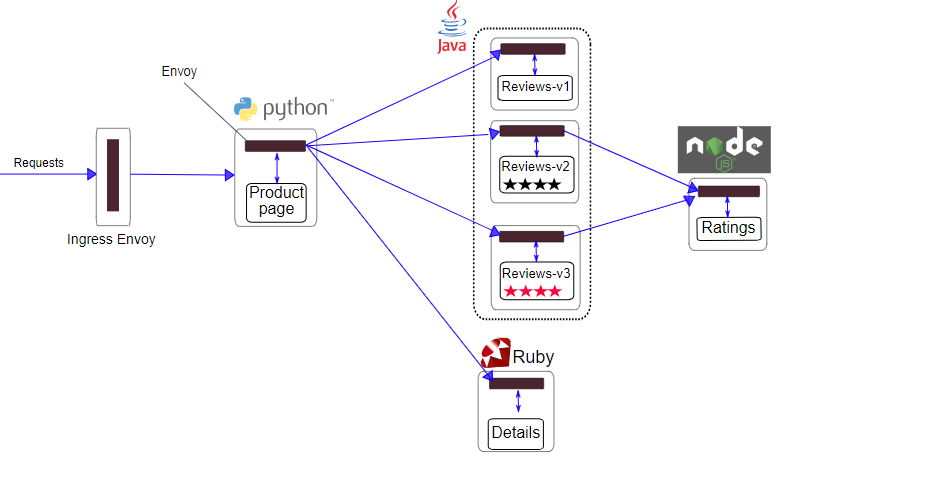

# ISTIO SERVICE-MESH DEPLOYMENT
Istio is an open source service mesh solution that enables developers to connect, control, monitor, and secure microservices architectures

## Istio Service-mesh Architecture
An Istio service mesh is logically split into a data plane and a control plane

- The data plane is composed of a set of intelligent proxies (Envoy) deployed as sidecars. These proxies mediate and control all network communication between microservices. They also collect and report telemetry on all mesh traffic.
- The control plane manages and configures the proxies to route traffic

### Control Plane
The Istio control plane is built of three key components:

- Pilot—uses the Envoy API to communicate with the Envoy sidecar. The pilot is responsible for traffic management, routing, and service inspection.
- Citadel—provides secure communication between services by managing user authentication, certificate and credential management.
- Galley—responsible for configuration management, distribution, and processing.

### Data Plane
The data plane consists of Envoy proxies deployed as sidecars, running alongside application instances in Kubernetes pods. The Envoy proxies manage traffic for services on the system, including managing and controlling network communication between microservices.

Here are key Istio features and tasks Envoy proxies enable:

- Traffic control: lets you enforce fine-grained traffic control and rich routing rules for gRPC, HTTP, WebSocket, and TCP traffic.
- Network resiliency: features include setup retries, circuit breakers, fault injection, and failovers.
- Security and authentication: Envoy proxies enable Istio to enforce security policies, access control, and rate limiting. You can define it using the configuration API.
- Pluggable extensions: this model is based on WebAssembly, which enables custom policy enforcement as well as telemetry generation for your mesh traffic

## BookInfo Deployment with Istio Service-mesh
The Bookinfo application is broken into four separate microservices:

1. productpage. The productpage microservice calls the details and reviews microservices to populate the page.
2. details. The details microservice contains book information.
3. reviews. The reviews microservice contains book reviews. It also calls the ratings microservice.
4. ratings. The ratings microservice contains book ranking information that accompanies a book review.

There are 3 versions of the reviews microservice:
1. Version v1 doesn’t call the ratings service.
2. Version v2 calls the ratings service, and displays each rating as 1 to 5 black stars.
3. Version v3 calls the ratings service, and displays each rating as 1 to 5 red stars

